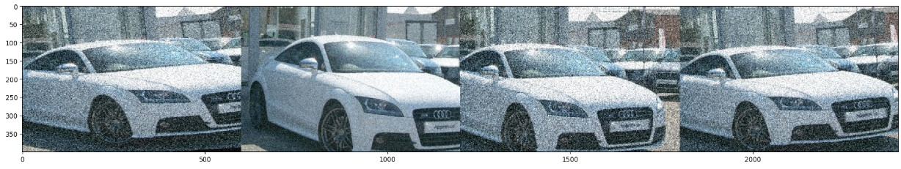

# Image Augmentation for Deep Learning
Since the amount of feed data have a direct impact on the precision of any Neural Network architectures, augmenting of data may seem to be a very good solution to broaden the amount of input data. This process is an increasingly demand for complex object detection and classification purposes. Since training **Deep Neural Networks (DNNs)** on more data can result in more precise outcomes and expand the training dataset, the process of augmentation may play an important role to provide better classification model. In this project data augmentation is done with **imgaug** library in **python**. 

## Environment:
- Python v3
- Anaconda
- Jupyter

## Supported Augmentation Operations:
- Horizontal and Vertical Shift
- Horizontal and Vertical Flip
- Random Rotation
- Random Brightness Change
- Random Zoom/Scale

## References:
1. [imgaug library](https://github.com/aleju/imgaug "imgaug library") in Python
2. [machinelearningmastery.com](http://machinelearningmastery.com "machinelearningmastery.com") website article: How to Configure Image Data Augmentation in Keras. ([See link](https://machinelearningmastery.com/how-to-configure-image-data-augmentation-when-training-deep-learning-neural-networks/ "See link"))
